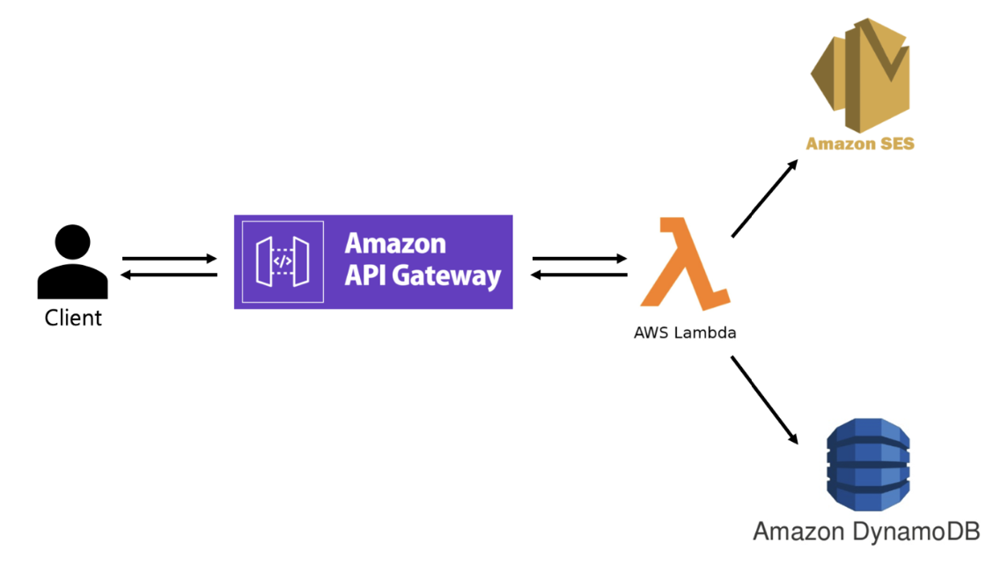

# 20242R0136COSE44400
고려대학교 COSE444 클라우드컴퓨팅

### Pipeline

### Componenets
**AWS Lambda**: 모든 로직(감정 분석, 데이터 저장, 이메일 전송)을 처리  
**API Gateway**: 클라이언트와 Lambda 함수 간 통신을 처리하는 인터페이스  
**DynamoDB**: 리뷰 데이터를 저장하는 NoSQL 데이터베이스  
**AWS SES**: 긍정적인 리뷰에 대해 관리자에게 알림 이메일 전송  

### Data Flow
**Client -> API Gateway**  
Client에서 POST 요청으로 리뷰 데이터 전달  
**API GAteway -> Lambda**  
API Gateway가 이벤트 데이터를 Lambda로 전달  
**Lambda**  
감정 분석 -> DynamoDB 저장 -> 긍정적 리뷰 이메일 전송  
**Lambda -> SES**  
긍정적 리뷰 알림 이메일 전송  
**Lambda -> API Gateway -> Client**  
성공 or 실패 메세지를 클라이언트로 반환  
